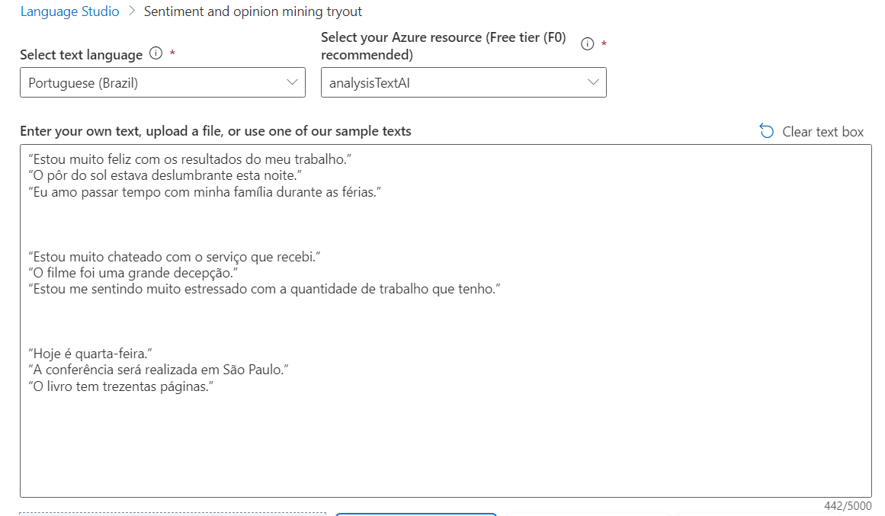
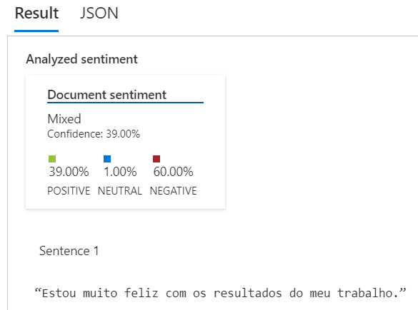
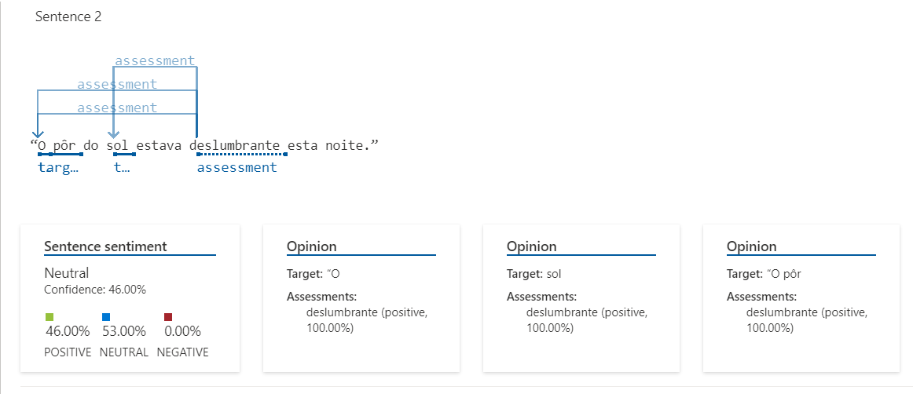
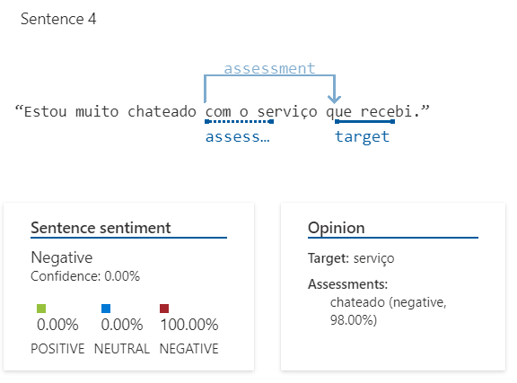

# Analise de texto com Language Studio
### Como Entregar esse projeto?

1. Crie um novo repositório no github com um nome a sua preferência
2. Crie uma pasta chamada 'inputs' e crie um documento de texto com algumas sentenças
3. Crie um arquivo chamado readme.md , deixe alguns prints descreva o processo, alguns insights e possibilidades que você aprendeu durante o conteúdo após a IA analisar suas sentenças
4. Compartilhe conosco o link desse repositório através do botão 'entregar projeto'

Ao explorar os recursos da linguagem Azure AI e analisar alguns exemplos de frases, é possível entender se as avaliações são em sua maioria positivas ou negativas.

O Processamento de Linguagem Natural (PNL) é um ramo da IA ​​que lida com a linguagem escrita e falada. Você pode usar a PNL para construir soluções que extraiam significado semântico de texto ou fala, ou que formulem respostas significativas em linguagem natural.

O Azure AI Language Service inclui análise de texto e recursos de PNL. Isso inclui a identificação de frases-chave no texto e a classificação do texto com base no sentimento.
### Como utilizar o Language Studio?

1. Abra o site do Language Studio em https://studio.azure.ai/
2. Faça login com a sua conta da Microsoft
3. Clique no botão 'Iniciar' e escolha o modelo de idioma que deseja utilizar
4. Clique no botão 'Iniciar' novamente e escolha o arquivo de texto que deseja analisar

Em outra guia do navegador, abra o portal do Azure em https://portal.azure.com , entrando com a conta da Microsoft associada à sua assinatura do Azure.

Clique no botão ＋Criar um recurso e pesquise Serviço de idioma . Selecione criar um plano de serviço de idiomas . Você será levado a uma página para selecionar recursos adicionais . Mantenha a seleção padrão e clique em Continuar para criar seu recurso .

Na página Criar Idioma , configure-o com as seguintes configurações:
Assinatura : sua assinatura do Azure .
Grupo de recursos : Selecione ou crie um grupo de recursos com um nome exclusivo .
Região : Leste dos EUA.
Nome : Insira um nome exclusivo .
Nível de preços : F0 grátis ou S se F0 grátis não estiver disponível
Ao marcar esta caixa, confirmo que li e compreendi todos os termos abaixo : Selecionado .
Selecione Revisar + criar e depois Criar e aguarde a conclusão da implantação.
Configure seu recurso no Azure AI Language Studio
Em outra guia do navegador, abra o Language Studio em https://language.cognitive.azure.com e entre.

Quando solicitado com Select an Azure resource , faça as seguintes configurações:

Diretório do Azure : diretório padrão, o diretório que você está usando
Assinatura do Azure : selecione a assinatura que você está usando
Tipo de recurso : Idioma
Nome do recurso : selecione o recurso de serviço de idioma que você acabou de criar

## Utilizando o Language Studio
#### Ao inserir algumas frases como essas no Language Studio 

É possível obter uma análise de sentimento para cada uma das frases.

Mostrando as palavras chaves das frases 

Fazendo uma análise de sentimento geral para cada frase para entender se os sentimentos são positivos, negativos ou neutros, como mostra imagem abaixo.

Então,  análise de sentimentos do Language Studio do Azure é um recurso que permite descobrir o que as pessoas pensam sobre uma marca ou tópico por exemplo,por meio da mineração de um texto para obter pistas

## Links Importantes   
[Explore Speech Studio](https://microsoftlearning.github.io/mslearn-ai-fundamentals/Instructions/Labs/09-speech.html)    
[Analyze text with Language Studio](https://microsoftlearning.github.io/mslearn-ai-fundamentals/Instructions/Labs/06-text-analysis.html)